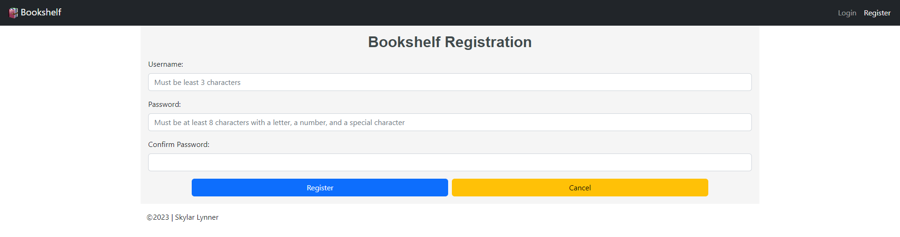
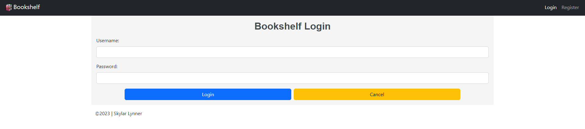
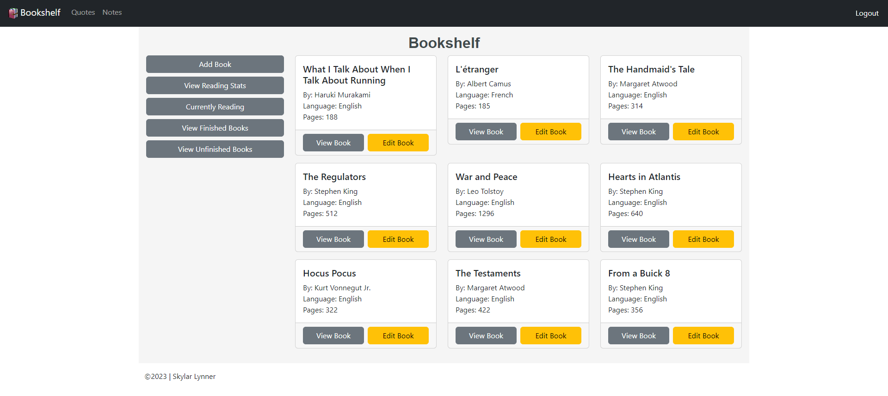
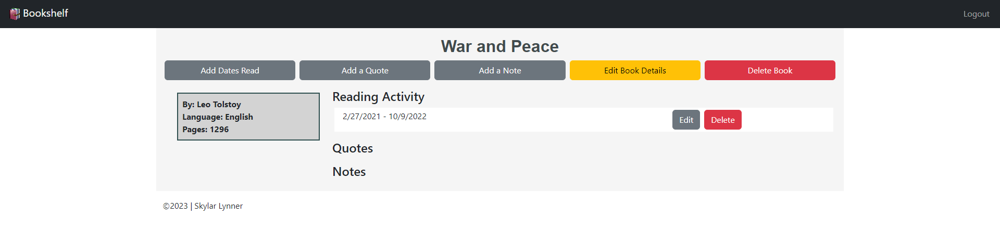
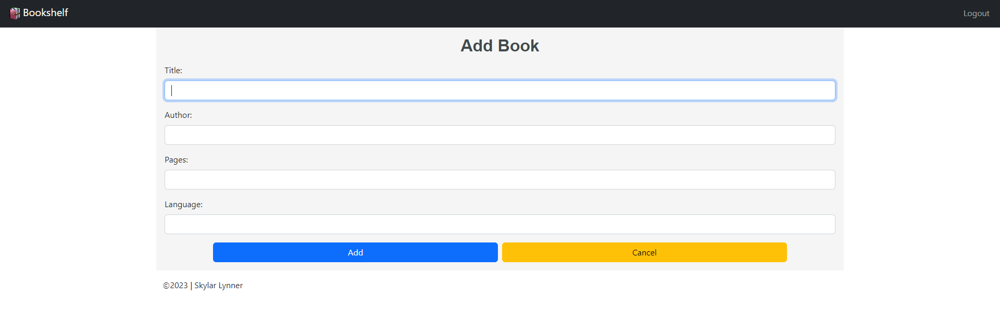
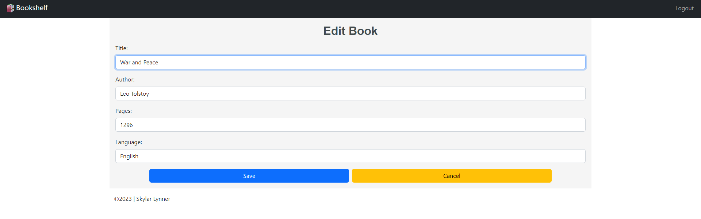
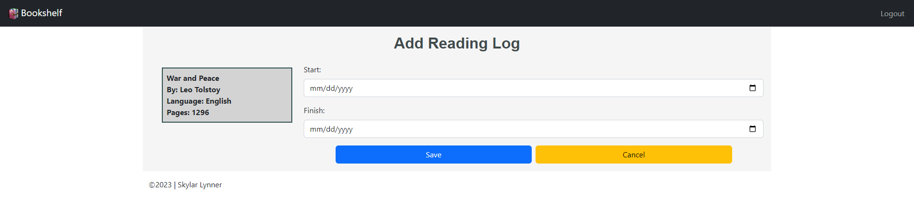
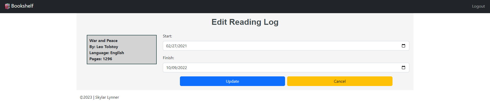

## Source Code

## Description

Keep all of your reading notes together in one place. Add books to your
bookshelf and track your reading habits.

## Languages, Frameworks, Technologies

- Java Spring
    - Spring Data JPA (Hibernate)
    - Spring Data REST
    - Spring Security
- MySQL database
- JUnit Jupiter and Mockito testing
- React
    - React Router v6
    - styled-components
- Bootstrap 5
- CSS3
    - modular CSS
- HTML5

## Requirements

### Functional

- RESTful API with JWT web token authentication
- login/logout and account registration
    - username length of 3-100 characters
    - password validation: 8 character length with at least one letter, one digit
      and one special character
- add, edit and delete books
- add and edit a book's reading activity

### Non-Functional

- user interface
    - React front-end interface
    - Bootstrap/CSS styling
    - utilize a card layout for books on bookshelf
- user experience
    - follow [WAI-ARIA specification](https://developer.mozilla.org/en-US/docs/Learn/Accessibility/WAI-ARIA_basics)
      to increase accessibility
      - allows for screen reader and keyboard navigation
      - assertive error display on forms to notify screen readers
      - provides descriptions of form field requirements
    - standardize custom components such as form input/submission and button
      formatting

## Screenshots

### Register for an Account and Login

### View Books on Bookshelf

### Add New Books and Edit Existing Books

### Track Reading by Adding and Editing Reading Logs

