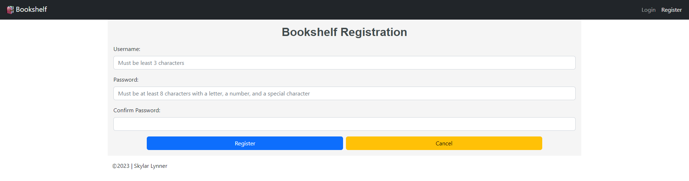
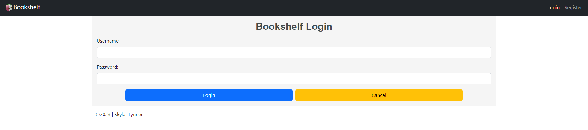
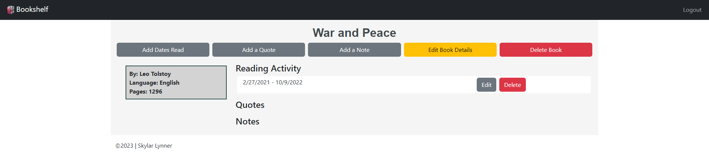
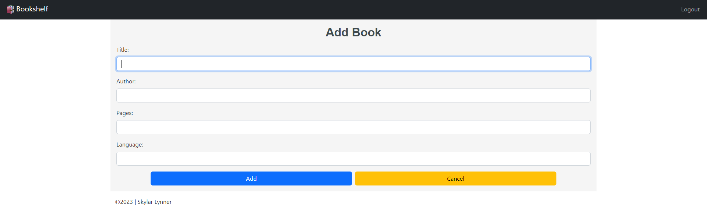
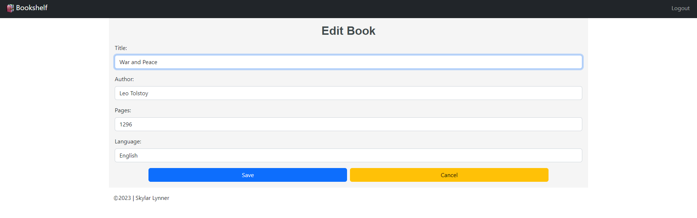
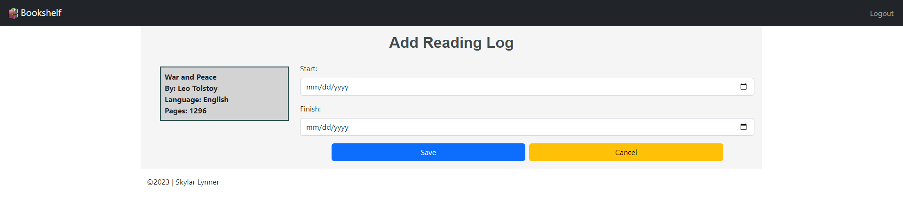
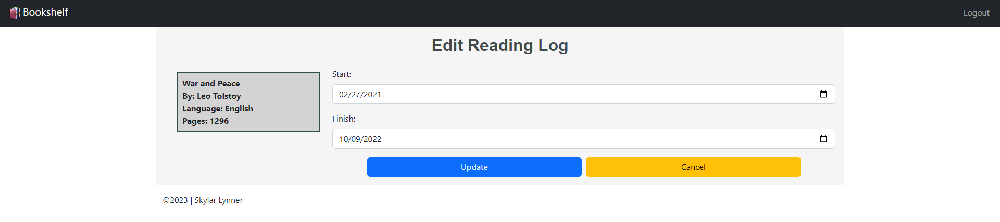

As someone who enjoys reading books in my free time, but doesn't always have 
the best memory for what I've read, I have become someone who tracks a lot of
my reading. I have tried keeping physical notes in notebooks and on various 
websites, so I'm in the process of creating a web application that will give 
me the reading statistics I'm interested in and provide a place to keep my 
notes together.

Some motivations for creating this project include 
[Ryan Holiday's Note Taking System](https://ryanholiday.medium.com/this-simple-note-taking-method-will-help-you-read-more-and-remember-what-youve-read-2cdf8010801)
and [Taking Book Notes (How to Start) by Tiago Forte](https://www.youtube.com/watch?v=fES9ZrLXY9s).

## Source Code

## Languages, Frameworks, Technologies

- Java Spring
    - Spring Data JPA (Hibernate)
    - JJWT
    - Spring Data REST
    - Spring Security
- MySQL database
- JUnit Jupiter and Mockito testing
- React
    - React Router v6
    - styled-components
- Bootstrap 5
- CSS3
    - modular CSS
- HTML5

## Requirements

### Functional

- RESTful API with JWT web token authentication
- Login/logout and account registration
    - Username length of 3-100 characters
    - Password validation: 8 character length with at least one letter, one digit
      and one special character
- Add, edit and delete books
- Add, edit and delete a book's reading activity

### Non-Functional

#### User Interface

- React front-end interface
- Bootstrap/CSS styling
- utilize a card layout for books on bookshelf

#### User Experience

- follow [WAI-ARIA specification](https://developer.mozilla.org/en-US/docs/Learn/Accessibility/WAI-ARIA_basics)
    to increase accessibility
    - allows for screen reader and keyboard navigation
    - assertive error display on forms to notify screen readers
    - provides descriptions of form field requirements
- standardize custom components such as form input/submission and button
    formatting

## Screenshots

### Register for an Account and Login

### View Books on Bookshelf

### Add New Books and Edit Existing Books

### Track Reading by Adding and Editing Reading Logs

